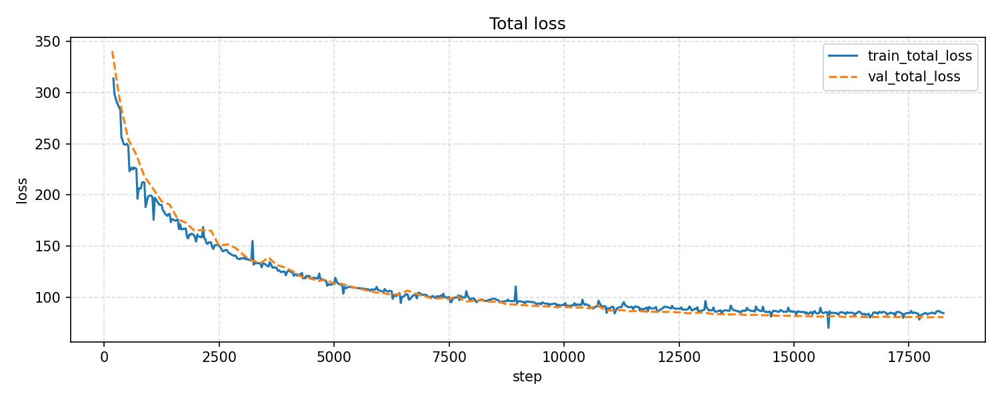
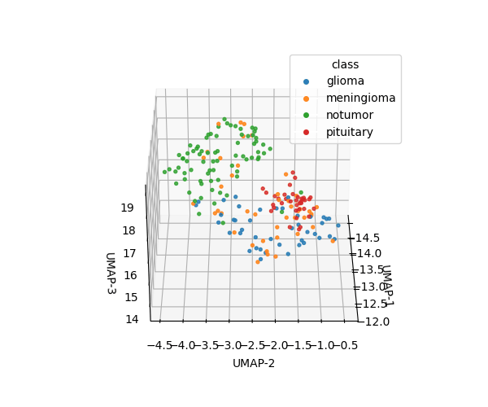
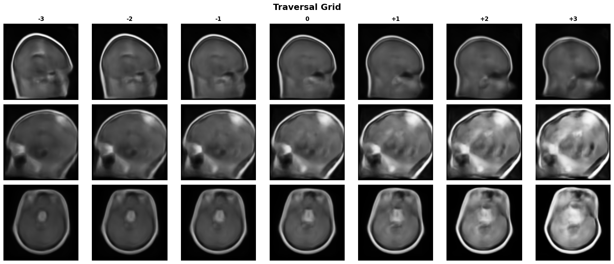
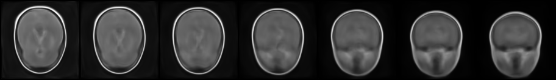

# Beta-VAE for Brain Tumor MRI

Variational Autoencoder with Squeeze-and-Excitation blocks for learning tumor-specific features from brain MRI slices. Built for applied research workflows (preprocessing → training → evaluation → interpretation).

## Visual Overview
- **Training stability**: phase losses (recon/kl/etc.).  
  
- **Recon quality**: input vs. reconstruction grid.  
  
- **Latent structure (3D UMAP)**: rotating embedding with class coloring.  
  
- **Traversals grid**: per-class latent traversals across ±3σ steps.  
  
- **Interpolations**: smooth latent walks between samples.  
  

## Quick Start
- Python 3.8+; CUDA GPU recommended.
- Install deps: `pip install -r requirements.txt`
- Optional: `export CONFIG_PATH=configs/beta_vae_se.yaml` (defaults to this file if unset).
- Prepare data under `data/braintumour/` (class folders like `glioma`, `meningioma`, `pituitary`, `notumor`), then:
  ```bash
  python scripts/preprocess_data.py
  ```
- Train:
  ```bash
  python src/training/train.py
  ```
- Evaluate core metrics and plots:
  ```bash
  python src/evaluation/run_evaluation.py
  python scripts/plot_logs.py
  python scripts/plot_phase_losses.py
  ```

## Project Layout
- `configs/` – experiment configs (default `beta_vae_se.yaml`).
- `data/` – raw and processed MRI slices.
- `outputs/` – logs, figures, tables, and model checkpoints (sharded `.pt`).
- `scripts/` – CLI utilities (preprocessing, plotting, traversals, resharding).
- `src/` – data processing, models, training loop, evaluation, inference, utils.

## Data Prep
1) Place raw images in `data/braintumour/<class>/`.
2) Normalize, resize, and split:
   ```bash
   python scripts/preprocess_data.py \
     --raw-dir data/braintumour \
     --out-dir data/processed
   ```
   (Flags are optional; defaults come from the config.)

## Training
```bash
python src/training/train.py \
  --config configs/beta_vae_se.yaml
```
- Mixed precision is enabled by default when CUDA is available.
- Checkpoints are saved sharded to `outputs/models/<run_id>_latest_shard*.pt` (and `best_*.pt`).

## Evaluation & Visuals
- Full evaluation suite:
  ```bash
  python src/evaluation/run_evaluation.py
  ```
- Log plots:
  ```bash
  python scripts/plot_logs.py
  python scripts/plot_phase_losses.py
  ```
- Quick overfit diagnostic on a small subset:
  ```bash
  python scripts/diag_overfit.py
  ```

## Inference & Traversals
- Encode latent vectors for a folder or single file:
  ```bash
  python src/inference/encode.py --path data/processed/test
  ```
- Generate samples from latents:
  ```bash
  python src/inference/generate.py --num-samples 16
  ```
- Latent traversals for a specific image:
  ```bash
  python scripts/traverse_image.py \
    --image path/to/image.png \
    --checkpoint best \
    --indices 0,1,2 \
    --span 3.0 \
    --steps 7
  ```

## Checkpoints & Shards
- Loading is done via `utils.brain_tumor_utils.io.load_sharded_checkpoint`, which transparently merges shards.
- To reshard (e.g., change shard count):
  ```bash
  python scripts/reshard_checkpoint.py --checkpoint latest --num-shards 6
  ```
- Default run id and paths are defined in `configs/beta_vae_se.yaml` (`paths.run_id`, `paths.models_dir`, etc.).

## Useful Scripts
- `scripts/preprocess_data.py` – build processed dataset.
- `scripts/plot_logs.py`, `scripts/plot_phase_losses.py` – visualize training curves.
- `scripts/traverse_image.py` – per-image latent traversals.
- `scripts/diag_overfit.py` – small-split reconstruction sanity check.
- `scripts/reshard_checkpoint.py` – merge and reshard checkpoints.

## Tips
- Override any config by exporting `CONFIG_PATH` or passing `--config` to scripts.
- Logs live in `outputs/logs/`; figures and tables are under `outputs/figures/` and `outputs/tables/`.
- If running CPU-only, ensure `training.mixed_precision` is compatible (set false if needed). 
