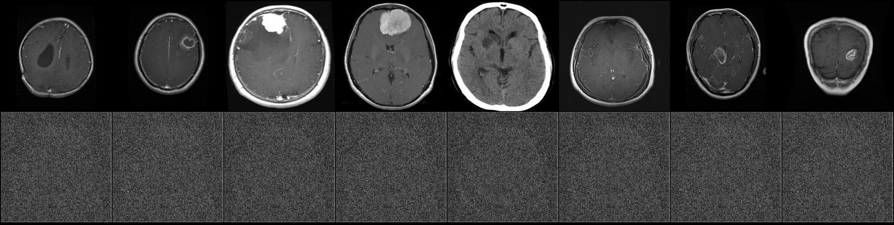

# NucleusNet

**A pipeline for learning tumor-specific features from brain MRI slices using a β-Variational Autoencoder (β-VAE) with Squeeze-and-Excitation blocks.**

<p align="center">
  
</p>

## Project Structure <br>
```
NucleusNet/ <br>
├── data/ <br>
│   ├── raw/                  # Original unprocessed MRI images <br>
│   └── processed/            # Normalized & resized images for training and testing <br>
├── docs/                     # Project documentation (API reference, design notes) <br>
├── configs/                  # Configuration files (YAML or JSON) for experiments <br>
├── notebooks/                # Jupyter notebooks for exploratory data analysis <br>
├── src/ <br>
│   ├── data_processing/      # Scripts to convert raw images into processed dataset <br>
│   ├── models/               # Model definitions: β-VAE, SE blocks <br>
│   ├── training/             # Training loop, loss definitions, callbacks <br>
│   ├── evaluation/           # Reconstruction metrics, latent visualizations, traversals <br>
│   ├── inference/            # Encoding & generation utilities for trained models <br>
│   └── utils/                # Shared utilities: I/O, logging, configuration parsing <br>
├── experiments/              # Experiment scripts & logs <br>
├── outputs/                  # Generated figures, trained models, result tables <br>
├── ci/                       # Continuous integration & testing scripts <br>
├── .gitignore <br>
├── requirements.txt          # Python dependencies <br>
├── installed_packages.txt    # Snapshot of installed packages & versions <br>
└── README.md                 <br>
```


## Prerequisites

- Python 3.8+  
- GPU with CUDA (optional but recommended for training)  
- Dependencies listed in `requirements.txt`

Install dependencies:

```bash
pip install -r requirements.txt
```
## Usage
1. Prepare data
    - Place raw MRI scans under data/raw/brain_tumor_dataset/
    - Run the preprocessing script or notebook in src/data_processing/ to populate data/processed/

2. Train model
```python
python src/training/train.py --config configs/beta_vae_se.yaml
```
3. Evaluate
```python
python src/evaluation/recon_metrics.py --model outputs/models/latest.pth
python src/evaluation/latent_viz.py  --model outputs/models/latest.pth
python src/evaluation/traversal.py   --model outputs/models/latest.pth
```
4. Inference / Generation
```bash
python src/inference/encode.py --input data/processed/test/...
python src/inference/generate.py --latent "0.1, -1.2, ..."
```
